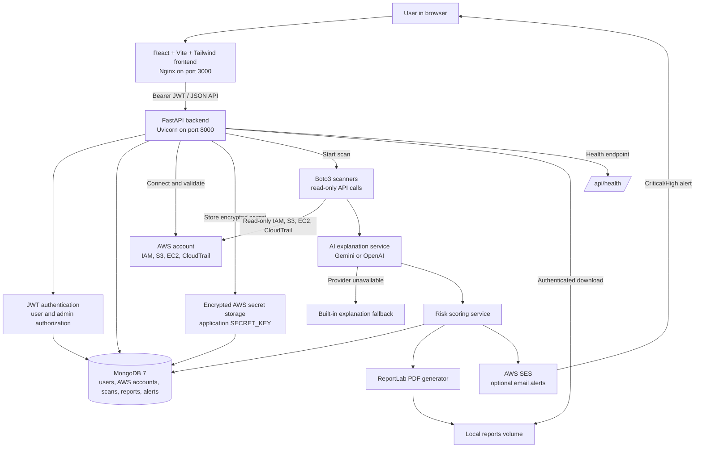

# CloudGuard AI Architecture

## Main Flow

1. The user authenticates through the React frontend and receives a JWT.
2. The user connects a demo account or real AWS account.
3. Real AWS credentials are validated with STS. Access-key secrets are encrypted before storage.
4. The scan route verifies the account belongs to the authenticated user and starts a background scan.
5. Boto3 reads IAM, S3, EC2, and CloudTrail configuration using read-only permissions.
6. Findings are enriched with Gemini/OpenAI when available; the built-in fallback keeps scans working when AI is unavailable.
7. The scoring service calculates overall and per-service scores.
8. Findings and scan status are stored in MongoDB.
9. Critical/High findings create alert records and optionally send email through SES.
10. Reports are generated locally and can only be downloaded through an authenticated API route.

## Deployment

Docker Compose runs three services:

- `frontend`: Nginx serves the Vite production build on `http://localhost:3000`.
- `backend`: FastAPI serves the API on `http://localhost:8000`.
- `mongodb`: MongoDB stores application data on the internal Compose network.
